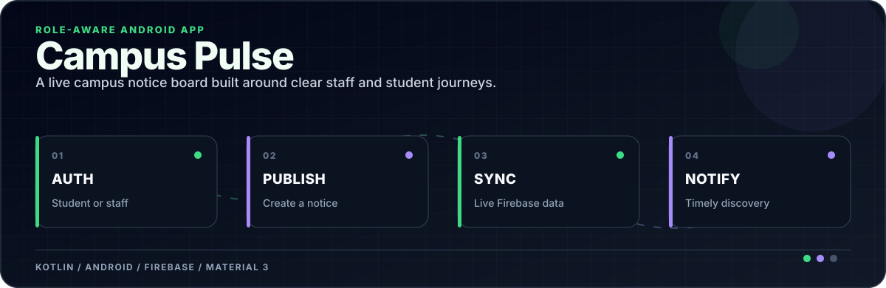
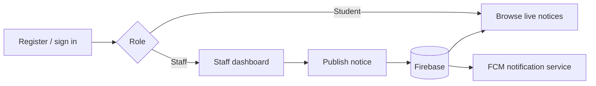

<div align="center">



</div>

[](./app)
[](./app/src/main/java)
[](./app/src/main)
[](./app/src/main/res)

**A role-aware campus notice board that keeps publishing simple for staff and discovery immediate for students.**

Campus Pulse is a native Android application with separate student and staff journeys, Firebase authentication, live notice data, and Firebase Cloud Messaging integration.

## User journeys



## Implemented

- Email/password registration and sign-in.
- Separate staff and student dashboards.
- Realtime notice list with loading, empty, and error feedback.
- Staff notice publishing and form validation.
- Notice counts and Material 3 interface components.
- Firebase Messaging service for notification delivery.

## Firebase setup

The Android application ID is `com.aman.campuspulse`. Firebase client configuration is intentionally excluded.

1. Create or select a Firebase project.
2. Register an Android app with that application ID.
3. Download `google-services.json`.
4. Place it at `app/google-services.json`; never commit it.
5. Enable Email/Password Authentication and configure the database/services expected by the app.

## Run

Open the repository in Android Studio, let Gradle sync, then run the `app` configuration on an emulator or device. The minimum supported version is Android 7.0 / API 24.

## Repository map

```text
app/src/main/java/.../LoginActivity.kt             authentication entry
app/src/main/java/.../StudentDashboardActivity.kt student notice experience
app/src/main/java/.../StaffDashboardActivity.kt   staff control surface
app/src/main/java/.../NoticeFormActivity.kt        notice publishing
app/src/main/java/.../MyFirebaseMessagingService.kt notification handling
app/src/main/res                                   layouts, themes, and resources
```

## Privacy boundary

Do not put service-account credentials in an Android client. Enforce role and write permissions in Firebase Security Rules rather than relying on hidden UI controls.
